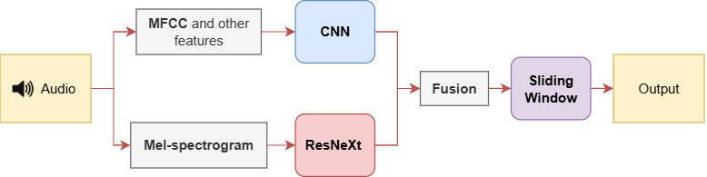
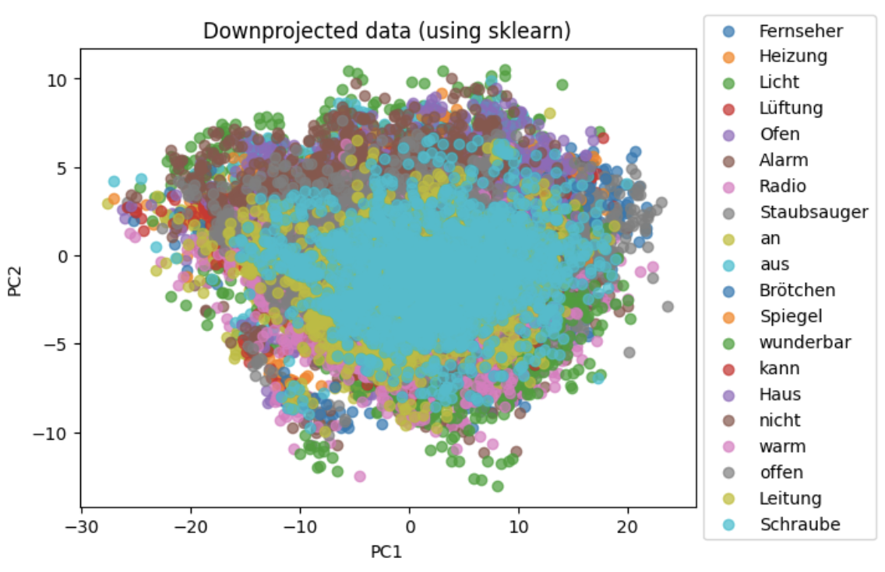
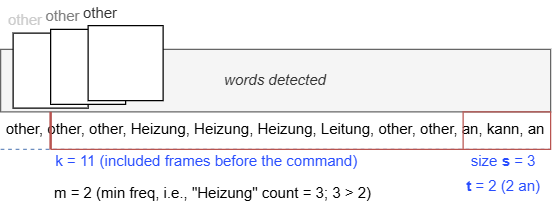
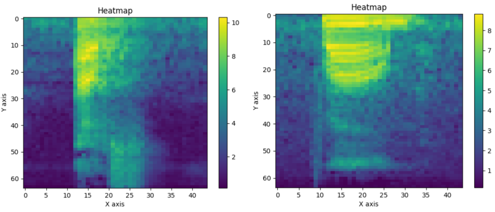

# Advanced Sliding Window Word Classification

This project performs real-time keyword spotting (command detection) in audio streams using a sliding-window deep learning architecture.

## TL;DR



A fusion model combining ResNeXt and a custom CNN for the final word detection.

- Uses a ResNeXt model to extract features from mel-spectrograms
- Uses a custom CNN to extract features from MFCC representations
- Performs online word detection using a sliding-window decision mechanism
- Designed to operate under noisy conditions

## Quick start

0. **Load model correctly**

```
git lfs install
git lfs pull
```

1. **Create and activate environment**

```
conda env create -f environment.yaml
conda activate wordrec_swresnet
```

2. **Run pretrained model on a single audio**
   
```
python swresnetx.py --model_name base_model --data_path data\scene\5_Lukas_Staubsauger_an_Licht_aus.npy
```

## Results

We evaluated multiple configurations of the sliding-window parameters and detection thresholds.

### Selected Configuration

We selected **m = 2 with configuration (3,2)** as the final model:

- Precision: **0.739**
- Recall: **0.467**

The selected configuration (m = 2, (3,2)) provides the best trade-off between recall and precision.

### Evaluation

We evaluate the model using Precision and Recall, focusing on false positives and false negatives. The data provided is relatively **balanced**.

## Data



Due to size and licensing restrictions, the dataset is not included in this repository.

Please download it from the official source (distributed by the Johannes Kepler University for the research) and place it in the `data/` directory. It is added to the section File Structure below. 

The data consists of recordings of 45,296 command words, as well as words labeled as `other`. We split the data into a validation set of 0.1, a test set of 0.2, and a training set of 0.70.

## Model overview

The model is a deep learning fusion architecture combining:
 - ResNeXt for mel-spectrogram feature extraction
 - A custom CNN for MFCCs and additional features (e.g., loudness and spectral contrast)

The model processes audio sequentially and confirms a command only if it appears consistently within a time window, reducing false positives.

### Decision Logic:



The decision to detect a word is made using a sliding window. 
 - The frame step size (**x**) controls how frequently predictions are made. 
 - It has a running window of size **s** in which the ResNeXt word "aus" or "an" must occur **t** times. 
 - If a command word appears more than **m** times within the window, the system triggers a detection.

### Model hyperparameters (Summary)

The best hyperparameter values are:
- Models: ResNeXt (fine-tuned), Custom CNN, FNN classifier
- Input: Single-channel spectrogram features
- Classes: 11
- Optimizer: AdamW (lr=1e-4)
- Batch size: 32
- Loss: CrossEntropyLoss

### Architectures
- ResNeXt → FC(512) → 11
- CNN → [Conv blocks] → FC(512) → 11
- Final classifier → FC(512) → 11

### Sliding Window:
| x | s | t | m |
|---|---|---|---|
| 2 | 3 | 2 | 2 |

## Run

```
To view available options and arguments for each script, run them with "--help".
```

All of the code was implemented in Python using **sklearn** and **PyTorch**. All required external libraries are listed in the `environment.yaml` file. Download pretrained model weights using Git LFS.

### Run the pretrained model on a single audio

```
python swresnetx.py --model_name base_model
```

This command performs command detection on the input audio. The input audio must be preprocessed into a `.npy` format. Audio processing is not part of this project. Please see the attached `idx_to_feature_name.csv` file for the expected attributes.

### Train a model:

```
python train_validate.py --model_name base_model_v2
```

### Perform the evaluation process

To evaluate the model with various hyperparameters of the sliding window model, run the following model:

```
python evaluation.py --model_name base_model --display --save
```

The evaluation produces results of the following form:

```
1, (1, 1) | Recall: 0.513  | Precision: 0.638 | TP: 607, FP: 345
1, (3, 2) | Recall: 0.481  | Precision: 0.700 | TP: 570, FP: 244
...
3, (4, 3) | Recall: 0.394  | Precision: 0.821 | TP: 467, FP: 102
```

| m | metrics   | (1,1) | (3,2) | (5,3) | (4,3) |
|---|-----------|-------|-------|-------|-------|
| 1 | Recall    | **0.513** | 0.481 | 0.444 | 0.443 |
|   | Precision | 0.638 | 0.700 | 0.743 | 0.753 |
| 2 | Recall    | *0.494* | 0.467 | 0.431 | 0.430 |
|   | Precision | 0.687 | 0.739 | 0.772 | 0.785 |
| 3 | Recall    | 0.448 | 0.427 | 0.396 | 0.394 |
|   | Precision | 0.740 | 0.787 | *0.811* | **0.821** |

Refer to the model overview for the hyperparameter names.

## Docker (optional)

You can run the project without installing dependencies locally using Docker.

### Build image

```bash
docker build -t keyword-spotting .
```

### Run pretrained model

If you have an NVIDIA GPU:

```bash
docker run --gpus all --rm keyword-spotting
```

## Error Analysis 

Several patterns were observed during data exploration:

For example, the word "Licht" was misclassified as "Leitung" before we adjusted the appropriate hyperparameters for our model.

In some cases, noise patterns resemble actual word features, for example:



Noise classified as "warm" compared to the actual word "warm".


## Project Information

### Contact

For questions, please open an issue or contact `r.chervinskyy@gmail.com`

### License

This project is licensed under the MIT License.

### File Structure

```
wordrec_swresnet/
 ├── data/
 │   ├── development_scenes/                # Excluded due to the license
 │   ├── scene/                             
 │   ├── test_scenes/                       # Excluded due to the license
 │   ├── development_scene_annotations.csv
 │   ├── development_scenes.csv
 │   ├── development.csv                    
 │   └── development.npy                    # Excluded due to the license
    
 ├── models/
 │   ├── configurations.json
 │   └── base_model/
 │       ├── results/
 │       ├── classifier.pt
 │       ├── config.pt
 │       ├── label_encoder.pkl
 │       ├── model_mel-spectrogram.pt
 │       └── model_mfcc.pt
    
 ├── data.py                                 # Dataset for the CNNs
 ├── swresnetx.py                            # Final sliding window model
 ├── evaluation.py                           # Full model evaluation
 ├── models.py                               # All models
 ├── train_validate.py                       # Training and Validation

 ├── images/                                 # Images used in the ReadMe
 ├── environment.yaml                        # Environment for the set-up
 ├── Dockerfile                              # Docker for reproducibility
 ├── .dockerignore                           # What files to ignore (data)
 ├── .gitignore                              # What files to ignore (data)
 ├── LICENSE.txt                             # MIT License (data is CC)
 └── README.md                               # <== You are here
```
